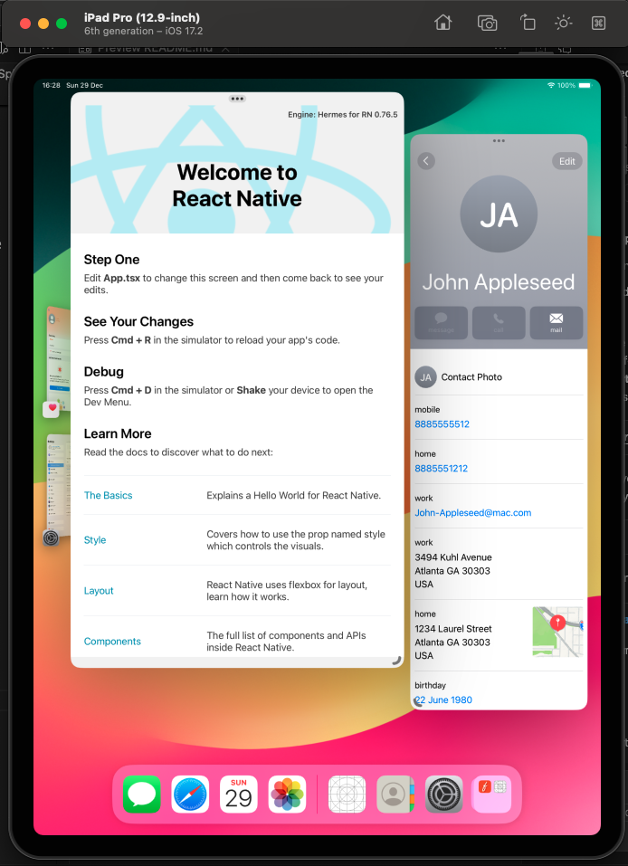
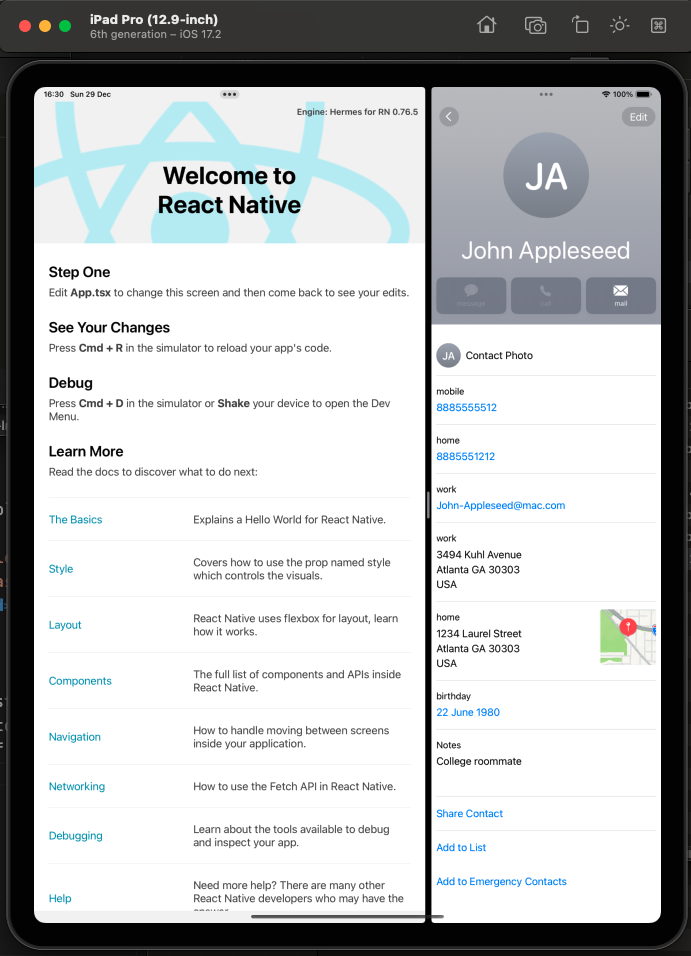

# rn-stage-manager-split-view

This is a demo React Native application that supports both iPad Split View and Stage Manger feature.

## How Split View and Stage Manager were added

To enable either Split View or Stage Manager you need to go to Settings -> Multitasking and Guestures

1. **iOS Configuration**: Updated the `Info.plist` to support multi-window and stage manager features.
2. **Window Management**: Add `SceneDelegate` and update `AppDelegate` to manage multiple windows. You need to add SceneDelagate class to `Compile Sources` section in `Build Phase`.
3. **Enabling Support for iPad**: Add `iPad` to `Supported Destinations`. `Requires full screen` needs to be `false`
4. **Testing**: Thoroughly tested the implementation on iPadOS to ensure smooth functionality of both split view and stage manager.

